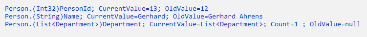

# Compare Object

Der Object Comparer besteht aus den Klassen **CompareObject** und **CompareResult**. Die Klasse dient dazu zwei Objekte des gleichen Types zu vergleichen und das Ergebnis über die Klasse **CompareResult** zurückgeben. 

```csharp
Person CurrentPerson = new Person();
CurrentPerson.PersonId = 13;
CurrentPerson.Name = "Gerhard";
CurrentPerson.Age = 60;
CurrentPerson.MeetingDate = null;

Person oldPerson = new Person();
oldPerson.PersonId = 12;
oldPerson.Name = "Gerhard Ahrens";
oldPerson.Age = 58;
oldPerson.MeetingDate = null;

Department dept = new Department();
dept.DepartmentId = 1;
dept.DepartmentName = "Development";
List<Department> deptList = new List<Department>();
deptList.Add(dept);

CurrentPerson.Department = deptList;
oldPerson.Department = null;

string[] ignorProperty = new IgnorWords().IgnorPropertiesAsArray;
List<CompareResult> compareResult = CompareObject.GetDifferences(CurrentPerson, oldPerson, ignorProperty);

foreach (CompareResult item in compareResult)
{
    var fullname = item.FullName;
    Console.WriteLine(fullname);
}
```

### Ergebnis



Bisher funktioniert noch kein "Deep"-Compare, damit ist gemeint, das auch Objekte in Objekte und Collections auf Unterschiede geprüft werden.
Ist in einem Objekt eine oder mehrere Collection definiert, wird hier der Count dazu ausgegeben.
